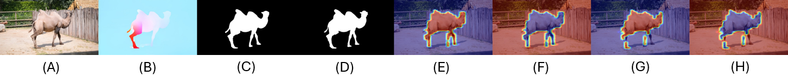

<div align="center">

<h3> Guided Slot Attention for Unsupervised Video Object Segmentation
 </h3> 
 <br/>
  <a href='https://arxiv.org/abs/2303.08314'></a> 
  <br/>
  <br/>
<div>
    <a href='https://hydragon.co.kr' target='_blank'>Minhyeok Lee <sup> 1</sup> </a>&emsp;
    <a href='https://suhwan-cho.github.io' target='_blank'>Suhwan Cho <sup> 1</sup></a>&emsp;
    <a href='https://dogyoonlee.github.io' target='_blank'>Dogyoon Lee <sup> 1</sup></a>&emsp;
    <a target='_blank'>Chaewon Park <sup> 1</sup></a>&emsp;
    <a href='https://jho-yonsei.github.io' target='_blank'>Jungho Lee <sup> 1</sup></a>&emsp;
    <a target='_blank'>Sangyoun Lee <sup>1,2</sup></a>&emsp;
</div>
<br>
<div>
                      <sup>1</sup> Yonsei University &nbsp;&nbsp;&nbsp;
                      <sup>2</sup> Korea Institute of Science and Technology (KIST) &nbsp;
</div>
<br>
<i><strong><a href='https://cvpr.thecvf.com' target='_blank'>CVPR 2024</a></strong></i>
<br>
<br>
</div>

[](https://paperswithcode.com/sota/unsupervised-video-object-segmentation-on-10?p=guided-slot-attention-for-unsupervised-video)
[](https://paperswithcode.com/sota/unsupervised-video-object-segmentation-on-11?p=guided-slot-attention-for-unsupervised-video)

## Abstract
Unsupervised video object segmentation aims to segment the most prominent object in a video sequence. However, the existence of complex backgrounds and multiple foreground objects make this task challenging. To address this issue, we propose a guided slot attention network to reinforce spatial structural information and obtain better foreground--background separation. The foreground and background slots, which are initialized with query guidance, are iteratively refined based on interactions with template information. Furthermore, to improve slot--template interaction and effectively fuse global and local features in the target and reference frames, K-nearest neighbors filtering and a feature aggregation transformer are introduced. The proposed model achieves state-of-the-art performance on two popular datasets. Additionally, we demonstrate the robustness of the proposed model in challenging scenes through various comparative experiments.

## Overview
<p align="center">
  
</p>


## Requirements
We use [fast_pytorch_kmeans](https://github.com/DeMoriarty/fast_pytorch_kmeans) for the GPU-accelerated Kmeans algorithm.
```
pip install fast-pytorch-kmeans
```

## Datasets
We use the [DUTS](http://saliencydetection.net/duts) train dataset for model pretraining and the [DAVIS 2016](https://davischallenge.org/davis2016/code.html) dataset for fintuning. For [DAVIS 2016](https://davischallenge.org/davis2016/code.html), [RAFT](https://github.com/princeton-vl/RAFT) is used to generate optical flow maps. The complete dataset directory structure is as follows:

```
dataset dir/
├── DUTS_train/
│   ├── RGB/
│   │   ├── sun_ekmqudbbrseiyiht.jpg
│   │   ├── sun_ejwwsnjzahzakyjq.jpg
│   │   └── ...
│   └── GT/
│       ├── sun_ekmqudbbrseiyiht.png
│       ├── sun_ejwwsnjzahzakyjq.png
│       └── ...
├── DAVIS_train/
│   ├── RGB/
│   │   ├── bear_00000.jpg
│   │   ├── bear_00001.jpg
│   │   └── ...
│   ├── GT/
│   │   ├── bear_00000.png
│   │   ├── bear_00001.png
│   │   └── ...
│   └── FLOW/
│       ├── bear_00000.jpg
│       ├── bear_00001.jpg
│       └── ...
└── DAVIS_test/
    ├── blackswan/
    │   ├── RGB/
    │   │   ├── blackswan_00000.jpg
    │   │   ├── blackswan_00001.jpg
    │   │   └── ...
    │   ├── GT/
    │   │   ├── blackswan_00000.png
    │   │   ├── blackswan_00001.png
    │   │   └── ...
    │   └── FLOW/
    │       ├── blackswan_00000.jpg
    │       ├── blackswan_00001.jpg
    │       └── ...
    ├── bmx-trees
    └── ...
```

## Training Model
We use a two-stage learning strategy: pretraining and finetuning.

### Pretraining
1. Edit config.py. The data root path option and GPU index should be modified.
2. training
```
python pretrain.py
```

### Finetuning
1. Edit config.py. The best model path generated during the pretraining process is required.
2. training
```
python train.py
```

## Evaluation
See this [link](https://github.com/yongliu20/DAVIS-evaluation).

## Result
An example of the resulting image is shown below.


* A : RGB image
* B : Optical Flow map
* C : Pred map
* D : GT
* E : Pred forground RGB slot attention map
* F : Pred background RGB slot attention map
* G : Pred forground Flow slot attention map
* H : Pred background Flow slot attention map

## Citation
```
@InProceedings{Lee_2024_CVPR,
    author    = {Lee, Minhyeok and Cho, Suhwan and Lee, Dogyoon and Park, Chaewon and Lee, Jungho and Lee, Sangyoun},
    title     = {Guided Slot Attention for Unsupervised Video Object Segmentation},
    booktitle = {Proceedings of the IEEE/CVF Conference on Computer Vision and Pattern Recognition (CVPR)},
    month     = {June},
    year      = {2024},
    pages     = {3807-3816}
}
```
